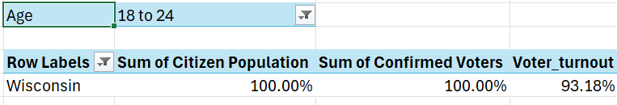

# USA-Voter-Demographics
Analyzing U.S. Voter Demographics Using the PivotTable created in the U.S. Voters case study

This project focuses on analyzing U.S. voter demographics using data from the U.S. Voters case study. The analysis leverages a PivotTable in Excel to explore and visualize key demographic patterns, such as voter age, gender, race, and geographic distribution. By manipulating the PivotTable, insights into voter trends and behavior are extracted to inform decision-making and policy discussions. The dataset provides a comprehensive overview of U.S. voting habits, with the goal of identifying significant trends and disparities.

How many states had a Voter Population % below 55%? Which states?

How many confirmed voters in California were over 65 years old in 2012? What percentage does that represent out of the total confirmed voters in California? What percentage out of the confirmed voters in the entire country?

Show both Citizen Population and Confirmed Voters by Age, as % of Column Total. What percentage of the citizen population do 45 to 64 year olds represent? What percentage of the confirmed voter population?   

Create a new calculated field named "Voter Turnout" (Confirmed Voters/Registered Voters), formatted as a percentage with 2 decimal points. Which state had the highest voter turnout rate? What about among 18-24 year old voters specifically?

